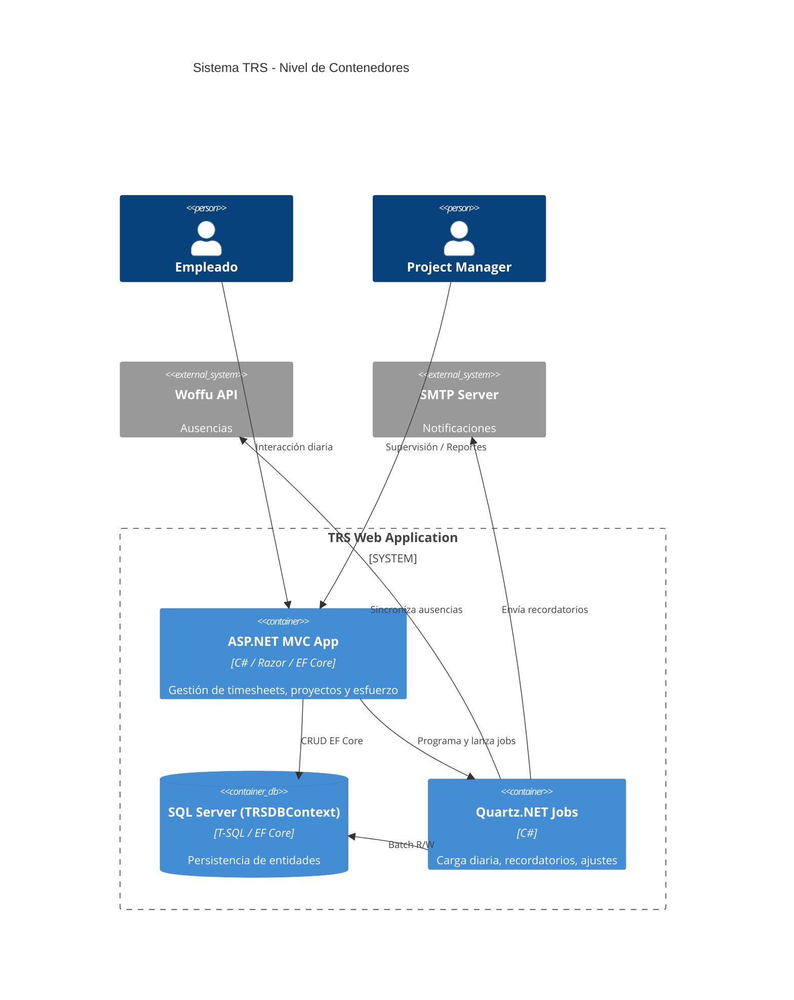
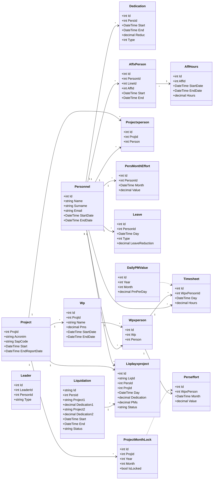
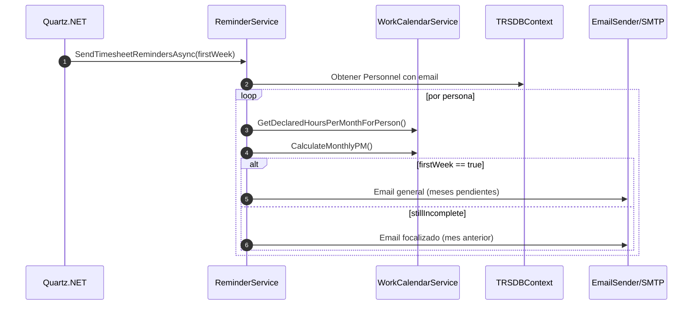
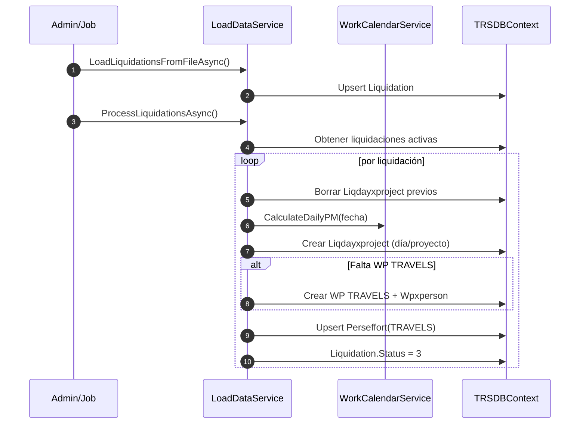
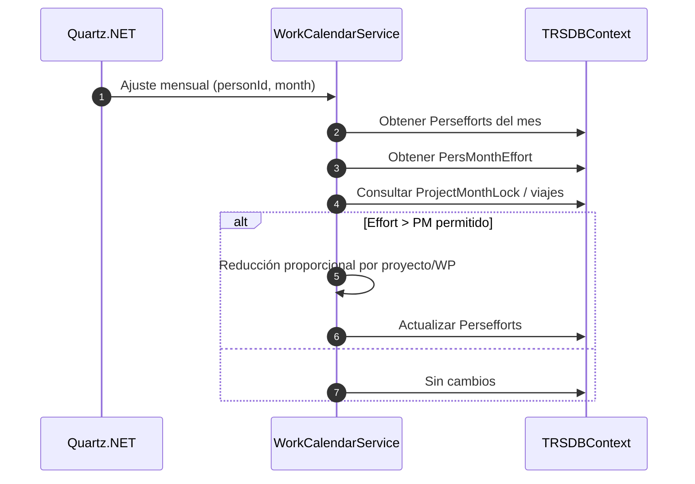
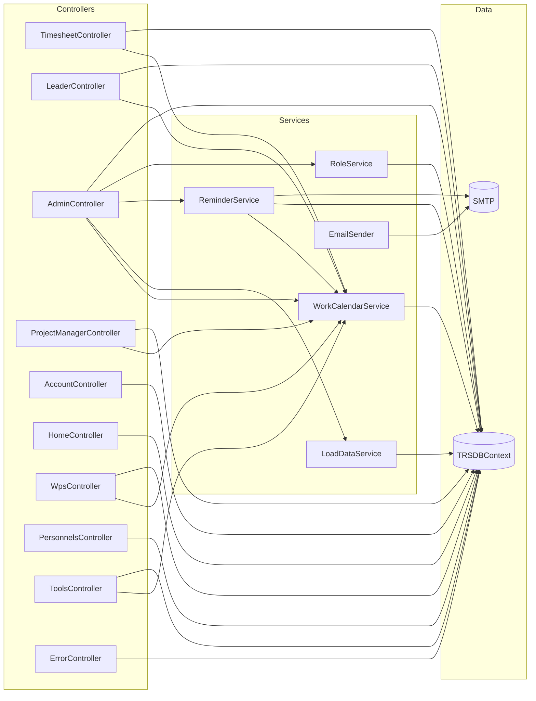

# TRS – Arquitectura y Flujos

> Documento de referencia arquitectónica para el sistema **TRS** (ASP.NET MVC, C#, EF Core, SQL Server).
>
> Cómo visualizar este documento en **Visual Studio 2022**: instala la extensión **“Markdown Editor (yuml / mermaid support)”** de Mads Kristensen y abre la vista previa de Markdown.

---

## Índice
1. [Visión General](#visión-general)
2. [C4 – Nivel Contexto](#c4--nivel-contexto)
3. [C4 – Nivel Contenedores](#c4--nivel-contenedores)
4. [Flujo de Datos Global (DFD)](#flujo-de-datos-global-dfd)
5. [UML de Clases (Modelo EF Core)](#uml-de-clases-modelo-ef-core)
6. [Diagramas de Secuencia (Procesos Clave)](#diagramas-de-secuencia-procesos-clave)
   - [Recordatorio de Timesheets](#recordatorio-de-timesheets)
   - [Carga y Procesado de Liquidaciones](#carga-y-procesado-de-liquidaciones)
   - [Ajuste Automático de Overload](#ajuste-automático-de-overload)
7. [Mapa de Dependencias (Controllers → Services → Datos)](#mapa-de-dependencias-controllers--services--datos)
8. [Cómo renderizar y exportar](#cómo-renderizar-y-exportar)

---

## Visión General
TRS es una aplicación **ASP.NET MVC** que gestiona dedicaciones, esfuerzos (PMs), ausencias y carga de datos externos. Los usuarios (Investigadores, Project Managers, Admin) interactúan mediante vistas Razor, mientras que la lógica de negocio se concentra en **Services** y el acceso a datos en **EF Core** a través de `TRSDBContext`. Procesos automáticos programados con **Quartz.NET** ejecutan sincronizaciones y recordatorios.

---

## C4 – Nivel Contexto
```mermaid
C4Context
    title Sistema TRS - Contexto General

    Person(user, "Empleado / Investigador", "Reporta horas y consulta su calendario")
    Person(pm, "Project Manager / Líder", "Supervisa efforts y asignaciones")
    Person(admin, "Administrador", "Gestiona usuarios, contratos, bloqueos y procesos")

    System(trs, "TRS WebApp", "ASP.NET MVC (C#, EF Core, SQL Server)")
    SystemDb(db, "SQL Server", "Base de datos de TRS")
    SystemExt(woffu, "Woffu API", "Origen de ausencias")
    SystemExt(mail, "SMTP / Email", "Envío de recordatorios y notificaciones")

    Rel(user, trs, "Uso vía navegador web")
    Rel(pm, trs, "Dashboards y reportes")
    Rel(admin, trs, "Configuración y tareas automáticas")

    Rel(trs, db, "Lectura/Escritura de datos de dominio")
    Rel(trs, woffu, "Importa ausencias y diarios")
    Rel(trs, mail, "Envía correos de recordatorio")
```

---

## C4 – Nivel Contenedores


---

## Flujo de Datos Global (DFD)
```mermaid
graph TD

    subgraph External Systems
        A[Woffu API]
        B[SMTP Server]
    end

    subgraph TRS Application
        C[Controllers (MVC)]
        D[Services (WorkCalendar, Reminder, LoadData, ...)]
        E[TRSDBContext]
    end

    subgraph Database
        F[(SQL Server - TRS)]
    end

    A --> D
    C --> D
    D --> E
    E --> F
    D --> B
```

**Resumen del flujo:**
1. Los **Controllers** reciben Peticiones HTTP y delegan en **Services**.
2. Los **Services** implementan reglas de negocio y acceden al **DbContext**.
3. **Quartz.NET** ejecuta procesos automáticos con el mismo pipeline.
4. **Woffu** aporta ausencias; **SMTP** recibe las notificaciones.

---

## UML de Clases (Modelo EF Core)


> *Nota:* Ajusta nombres o campos si tu `TRSDBContext` difiere en alguna entidad.

---

## Diagramas de Secuencia (Procesos Clave)

### Recordatorio de Timesheets


### Carga y Procesado de Liquidaciones


### Ajuste Automático de Overload


---

## Mapa de Dependencias (Controllers → Services → Datos)


---

## Cómo renderizar y exportar
- **Visual Studio 2022**: instala la extensión **“Markdown Editor (yuml / mermaid support)”** y abre la vista previa del `.md`.
- **GitHub/GitLab/Azure DevOps**: sube este `ARCHITECTURE.md`; renderizan Mermaid nativamente.
- **Mermaid Live**: copia cualquier bloque en [https://mermaid.live](https://mermaid.live) y usa *Export → PNG/SVG*.

> Sugerencia: guarda también versiones PNG/SVG en `docs/` si vas a incluirlas en presentaciones o PDFs.

